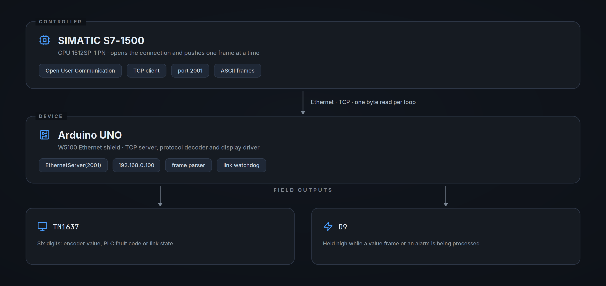
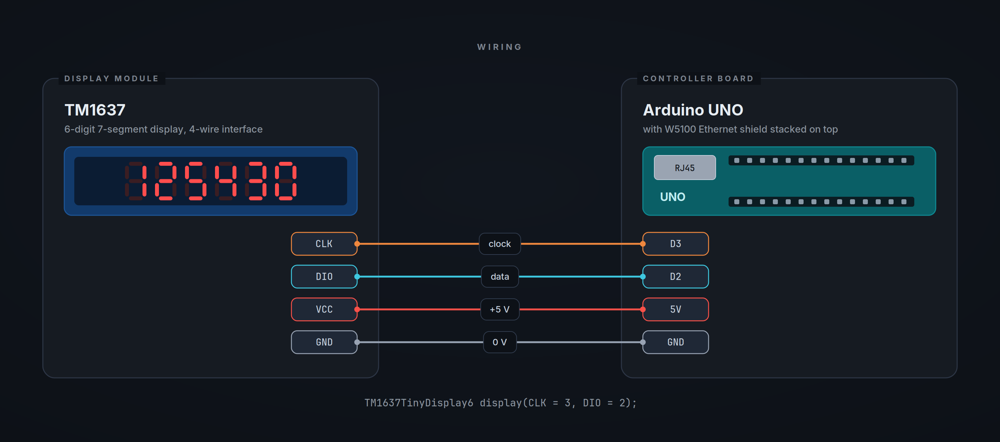

# plc-siemens-arduino-display

**An Arduino UNO that listens on TCP and turns what a Siemens PLC sends into readable digits on a shop-floor display.**

Ethernet link between a SIMATIC S7-1500 and a 6-digit 7-segment module,
carrying live encoder values, fault codes and link diagnostics.

> [!NOTE]
> This repository holds the **Arduino side** of the link. The PLC program is
> a plain TCP client that opens the connection and pushes the frames
> described below; the STEP 7 project is not published here.

---

## What it is

A PLC has the numbers — the position of an axis, the state of a machine, the
code of an active alarm — but no cheap way of putting them in front of an
operator standing at the machine. An industrial HMI for a single value is
expensive and slow to wire in.

This is the low-cost alternative: an Arduino UNO with an Ethernet shield
sits on the plant network as a **TCP server**, the PLC connects to it as a
client and streams short ASCII frames, and the Arduino decodes them onto a
six-digit display. The same channel carries fault codes, and the firmware
watches the link itself so that a dead connection is visible on the display
rather than frozen on the last value received.

---

## Architecture

<picture>
  <source media="(prefers-color-scheme: dark)" srcset="assets/architecture.png">
  
</picture>

---

## Protocol

The PLC sends a byte at a time; the Arduino reads one byte per loop pass and
runs a small state machine over it. A frame opens with a control character,
carries up to six payload characters and closes with `f`.

| Byte | Role | Effect on the Arduino |
| --- | --- | --- |
| `e` | Value frame, axis **moving** | Clears the buffer, drops any latched fault, raises `D9`, starts capturing |
| `t` | Value frame, **target reached** | Same as `e`, and the value is shown blinking |
| *payload* | Up to six characters | Written into the display buffer in order of arrival |
| `f` | End of frame | Stops capturing, clears the alarm latch, releases `D9` |
| `a` | Alarm frame | Raises `D9` and arms the fault latch |
| *code* | Single character after `a` | Stored as the PLC fault code |

**Examples**

| Frame | Result on the display |
| --- | --- |
| `e125430f` | `125430`, steady — the axis is moving |
| `t001250f` | `001250`, blinking — the axis is at target |
| `a2f` | `plcF02` — fault 2 reported by the PLC |

A value frame clears a displayed fault, so recovery needs no dedicated
reset command.

---

## Display behaviour

Three sources compete for the six digits, resolved by a fixed priority:

1. **`no CON`** — the link watchdog has expired: no data from the PLC
2. **`plcF0x`** — a fault code was received and latched
3. **the encoder value** — steady while moving, blinking once at target

The blink is a duty cycle of the main loop, roughly twenty passes blank
against fifty passes lit, so a value that has just landed on target draws
the eye without becoming unreadable.

The watchdog counts loop passes in which no data is waiting; past one
hundred it raises the internal fault and prints `no CON`. Any incoming byte
resets it.

---

## Hardware

| Part | Notes |
| --- | --- |
| **Arduino UNO** | Any ATmega328P board with the standard header layout |
| **W5100 Ethernet shield** | Stacked on the UNO, driven over SPI |
| **TM1637 6-digit display** | Common 4-wire module, driven at `BRIGHT_HIGH` |
| **Digital output `D9`** | Held high while a value frame or an alarm is being processed, released on `f` |

---

## Wiring

<picture>
  <source media="(prefers-color-scheme: dark)" srcset="assets/wiring.png">
  
</picture>

| TM1637 | Arduino |
| --- | --- |
| `CLK` | `D3` |
| `DIO` | `D2` |
| `VCC` | `5V` |
| `GND` | `GND` |

> [!IMPORTANT]
> `CLK` is on **D3** and `DIO` on **D2** — the opposite of the assignment
> used in most TM1637 tutorials. Swapping the two leaves the display blank.

---

## Network configuration

| Setting | Value |
| --- | --- |
| Role | TCP **server** (the PLC connects to it) |
| MAC address | `DE:AD:BE:EF:FE:ED` |
| IP address | `192.168.0.100`, static |
| Port | `2001` |

Both values live at the top of the sketch and can be changed to match the
plant subnet; the PLC connection has to be updated to match.

---

## Getting started

**1. Install the display library**

In the Arduino IDE, open *Library Manager* and install **TM1637TinyDisplay**,
which provides the six-digit `TM1637TinyDisplay6` class. `SPI` and `Ethernet`
ship with the IDE.

**2. Check the network settings**

Adjust `ip[]` and the `EthernetServer` port at the top of the sketch if the
defaults clash with the plant addressing.

**3. Upload the sketch**

Select *Arduino UNO*, pick the serial port and upload.

**4. Configure the PLC side**

Open an active TCP connection towards `192.168.0.100:2001` and send the
frames described above. Until the first byte arrives the display shows
`no CON`, which doubles as a wiring check.

---

## Notes and limitations

- **One byte per loop pass.** Throughput follows the loop rate rather than
  the network; the PLC should pace its frames accordingly.
- **Timers are loop counters, not milliseconds.** The watchdog threshold and
  the blink cycle shift if the loop time changes.
- **Frames must stay within six payload characters.** The capture index is
  not bounded, so a longer frame writes past the end of the buffer.
- **The watchdog reacts to silence, not to link loss.** It measures data
  availability, so a PLC that is connected but idle also raises `no CON`.
- **No authentication or encryption.** The device belongs on a segregated
  machine network, never on a routed or public one.
- `Wire.h` is included and the serial port is opened at 9600 baud, but
  neither is used by the current firmware.

---

## Author

Built by [@AndreaMarangione](https://github.com/AndreaMarangione).

---

## License

Distributed under the **GNU General Public License v3.0**. See [`LICENSE`](LICENSE) for the full text.
